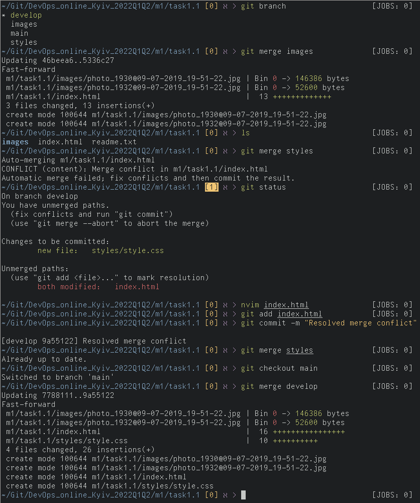

# Task 1.1

## 1.1.1 Git

As a result of following instructions to the task, I have:

- created new git repository
- created three new branches (develop, images, styles)
- made commits on these branches

After modifying the same file on two branches with common parent, and trying to merge them back, a merge conflict was encountered:



To resolve it, I edited conflicting file `index.html` by manually merging changes delimited by conflict markers and then removing them.

Afterwards, the resolution could be successfuly commited into develop branch and then into main as follows:

```
* 272de78 - Thu, 3 Feb 2022 14:55:13 +0200 (44 minutes ago) (HEAD -> main, origin/main)
|           Add task1.1_GIT.txt - roborg-codes|
| 16	0	m1/task1.1/task1.1_GIT.txt
|
*   9a55122 - Thu, 3 Feb 2022 14:44:38 +0200 (55 minutes ago) (origin/develop, develop)
|\            Resolved merge conflict - roborg-codes
| |
| * 80b1e06 - Thu, 3 Feb 2022 14:36:37 +0200 (63 minutes ago) (origin/styles, styles)
| |           Change index.html - roborg-codes| |
| | 13	0	m1/task1.1/index.html
| |
| * 51d66c9 - Thu, 3 Feb 2022 14:36:06 +0200 (64 minutes ago)
| |           Create style.css - roborg-codes| |
| | 10	0	m1/task1.1/styles/style.css
| |
* | 5336c27 - Thu, 3 Feb 2022 14:31:27 +0200 (68 minutes ago) (origin/images, images)
| |           Add images source - roborg-codes| |
| | 13	0	m1/task1.1/index.html
| |
* | 9616696 - Thu, 3 Feb 2022 14:27:59 +0200 (72 minutes ago)
|/            Add new images - roborg-codes|
|   -	-	m1/task1.1/images/photo_1930@09-07-2019_19-51-22.jpg
|   -	-	m1/task1.1/images/photo_1932@09-07-2019_19-51-22.jpg
|
* 46beea6 - Thu, 3 Feb 2022 14:16:01 +0200 (84 minutes ago)
|           Create index.html - roborg-codes|
| 0	0	m1/task1.1/index.html
|
* 7788111 - Thu, 3 Feb 2022 14:15:05 +0200 (85 minutes ago)
            init commit - roborg-codes
  0	0	m1/task1.1/readme.txt
```
Thus finalizing merge of conflicting branches into `main` and pushing repo to git remote.

For more complex or numerous conflicts, it would be prudent to use `git mergetool`, sice it helps to step through all conflicts sequentially for extra precision and not to skip any unhandled conflicts.
Followed by `git clean`, of course.


## 1.1.2 Describe what DevOps is.
DevOps is an approach in systems design that is concerned with improving (and streamlining) both development and operations processes by utilizing *automation* tools for testing and deployment of the product.
DevOps also *designs, manages, and monitors* infrastructure used in the project by both developers and customers.
```shell
$ wc -w
46
```
