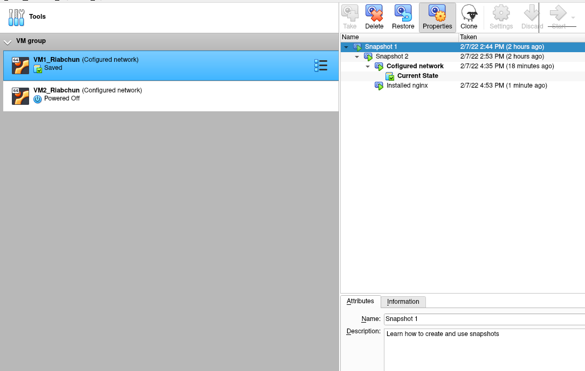
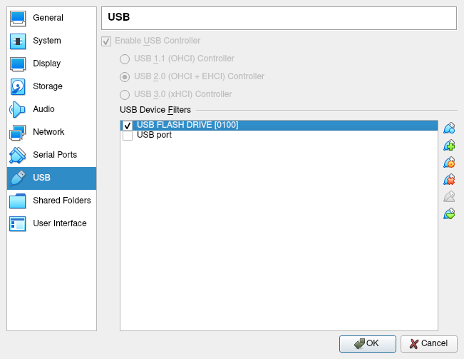
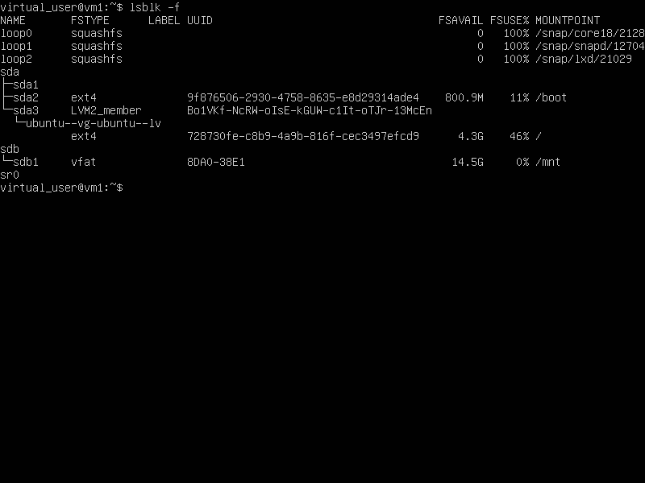
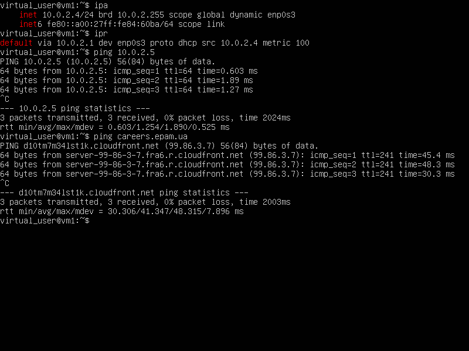
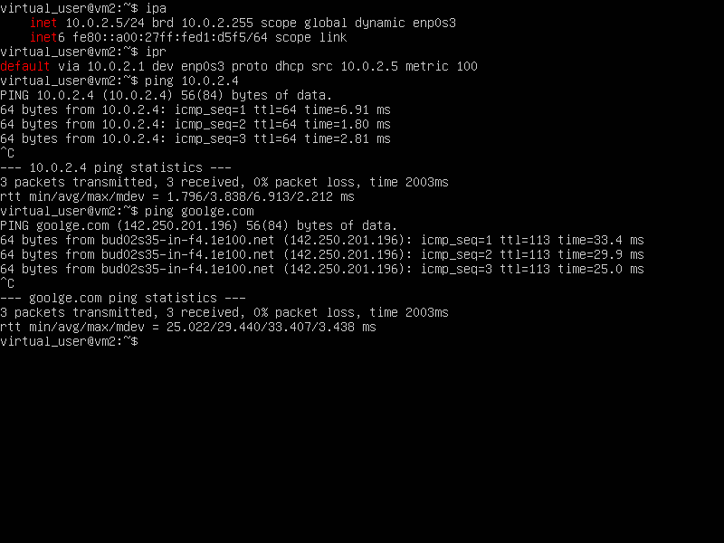
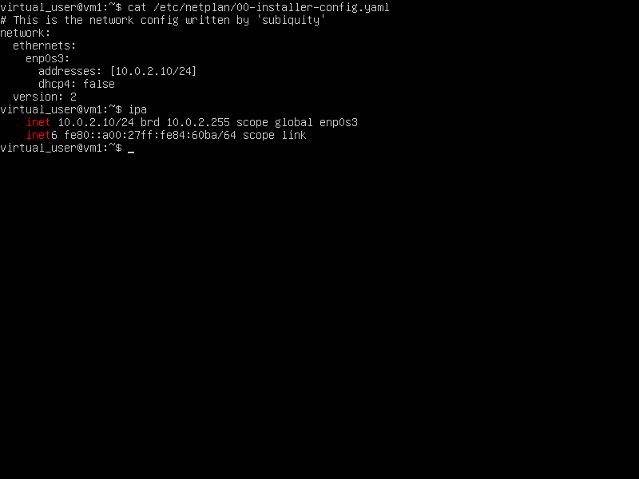
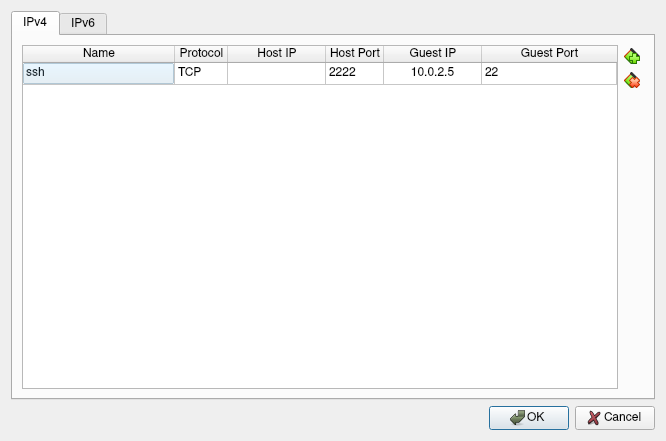
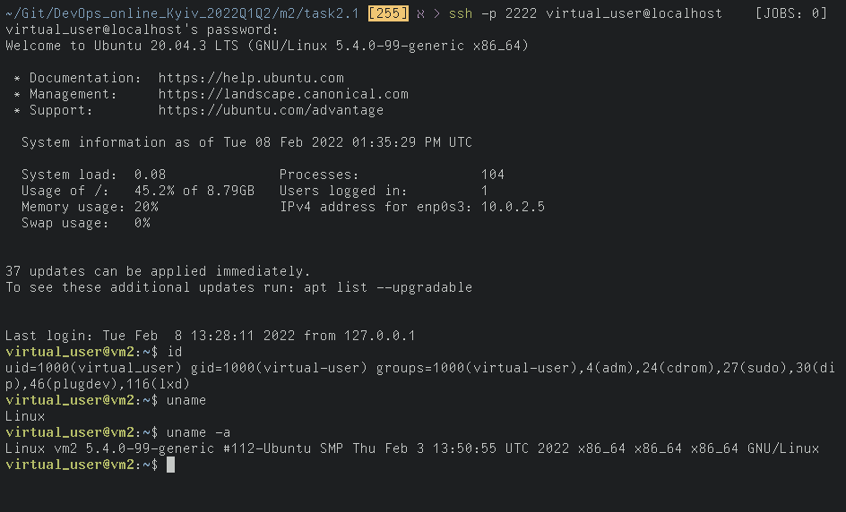
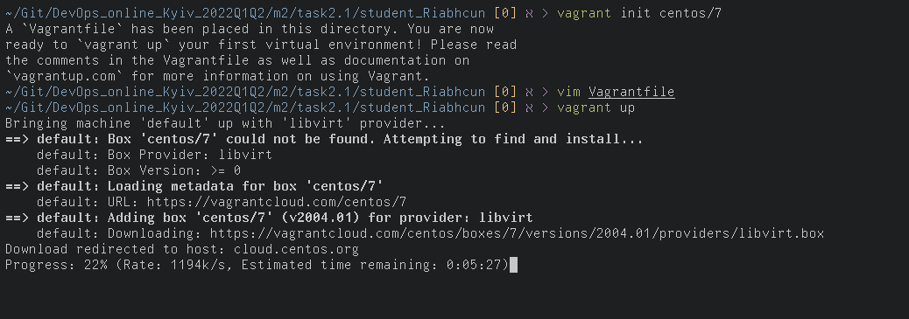

# Task 2.1

## Hypervisors 2.1.1

What are the most popular hypervisors for infrastructure virtualization?
---

Among popular ones are:

- KVM (various environments, like RHEV)
- Xen & Citrix Hypervisor, formerly XenServer
- Microsoft Hyper-V
- Wmware ESXi (under vSphere)


Briefly describe the main differences of the most popular hypervisors.
---

Most of the mentioned hypervisors come with a suite of additional software for virtualization management.

The most extensive suite is offerred by VMware's vSphere. It implements varoius security, performance and management features as a monolithic type1 hypervisor.
However, it lacks support for scaling VM count, compared to other hypervisors.
Monolithic design also limits hardware supprot.

Xen hypervisor and XenServer build upon well-tested and stable OSS.
One of it's main pros is it's software architecture, which takes advantage of running on hardware directly, greatly improving performance.
Still, XenServer supports even less powerful hardware, than vSphere.

Microsoft's Hyper-V implements a type1 microkernel approach, which improves compatability and betters security and shortens initialization time.
Still, Hyper-V has compatability issues with some distributions Linux.
Due to partitioning design, Hyper-V requires a parent OS to operate child OSes, which increases the risk of collateral damage done by faulty parent OS.

Unlike other hypervisors, KVM uses a Linux kernel module and integrates with additional usermode components (i.e. QEMU).
KVM can use assistance of CPU to provide virtualization, increasing performance.
Although this is similar to what Xen does, KVM is more lightweight and simple.
KVM is also licenced under GPL, so it's source code is fully accessible.
KVM is a built-in of Linux kernel, meaning that it's not portable to Windows.
It's simplicity also means that some features have to be made available throug usermode components, such as emulation.

All of the above hypervisor support live migrations or a variant of it.
Meaning that moving VMs over LAN is seamless\*.


## 2.1.2 Working with hypervisors

After installing VirtualBox and downloading ubuntu server, I had a basic setup to work with.

First, I made a clone of this VM and added both of them to a single group.

Afterwards, I have created a little snapshot tree with different stages of cofiguration:



Later, I exported one of the VMs as .ova, deleted VM, and then imported it again

Then I worked on cofiguring both machines.
Here is simple usb connection:



And after creating a new filter, usb can be accessed as block device.



Configuring shared folder in VirtualBox's GUI turned out to be a pain, so instead I used `vboxmanage` to create one:

On host machine

```shell
# vboxmanage sharedfolder add "VM2_Riabchun" --name "shared_folder" --hostpath ~/Git/DevOps_online_Kyiv_2022Q1Q2/m2/task2.1/shared_folder --transient
```

On guest machine

```shell
# mkdir /media/share
# mount -t vboxsf shared_folder /media/share
```

`--transient` flag allows to share files at runtime, which is what I wanted but couldn't figure out in GUI.

Next step was to connect both machines to a single network.

To achieve this, I connected both machines to `NAT network`.
This results in dhcp server assigning different IP addresses and both machines being visible to each other.





And even though this network uses DHCP, it is possible to assign static IP:



With this configuration

| Mode        | VM -> Host | VM <- Host | VM1 <-> VM2 | VM -> LAN | VM <- LAN |
|-------------|------------|------------|-------------|-----------|-----------|
| NAT Network | OK         | 80:8080    | OK          | OK        | 8080:80   |
|             |            | 22:2222    |             |           | 2222:22   |
|             |            | etc.       |             |           | etc.      |

Other modes do a variation of this, for example `internal network` mode would be the most restrictive.
Only allowing `VM1 <-> VM2` connections.

Configuring port forwarding would be done like this:



or through

```shell
# vboxmanage modifyvm 'VM1_Riabchun' --natpfl "ssh,tcp,,2222,22"
```

resulting in a successful ssh connection:



## 2.1.3 Work with Vagrant

After downloading and installing vagrant, I checked path to vagrant bin:

```shell
$ which vagrant
/usr/bin/vagrant
```

Then, I ran `vagrant init`, albeit with a different box, since the one provided in task didn't support `libvirt` provider and I wanted to try different one this time.

After examining `Vagrantfile`, it was time to pull the image and run the box:



Further process required some troubleshooting, but eventually I got the box up and running.
By default box was actually available on LAN:


Afterwards I stopped and deleted the box

```shell
$ vagrant halt
$ vagrant destroy
```

I then proceeded to create a custom `Vagrantfile`.
For this one, I decided to go with a simple setup that forwads ports 80 -> 8080.
It then, through provisioning sets up a basic nginx setup, creates a new user on VM, and links folders `/var/www/html` on gues to `./html` on host.
So that changes in `./html` are visible in browser.
This could be extended with custom nginx configuration, but that is out of scope.

The following is the `Vagrantfile` itself:

```Vagrantfile
VAGRANT_API="2"
Vagrant.configure(VAGRANT_API) do |config|

  config.vm.box = "ubuntu/focal64"
  config.vm.box_check_update = true

  config.vm.network "forwarded_port", guest: 80, host: 1234, host_ip: "127.0.0.1"

  config.vm.synced_folder "./html", "/var/www/html"

  config.vm.provider "virtualbox" do |vb|
    vb.name = "ubuntu-vm"
    vb.cpus = 2
    vb.memory = "2048"
    vb.gui = false
  end

  config.vm.provision "shell", inline: <<-SHELL
    useradd -m -G sudo virtual_user && printf "Created new user virtual_user successfuly.\n"
    chpasswd <<< 'virtual_user:password' && printf "Set default virtual_user password to 'password'.\n"

    apt update && apt install -y nginx && printf "Successfuly installed nginx.\n"
    systemctl start nginx && systemctl enable nginx && printf "Successfuly started nginx.\n"

    echo "<h1>Hello from VM! I'm $USER.</h1>" > /var/www/html/index.nginx-debian.html
  SHELL
end
```
