# Task 2.2

## Tasks 2.2.1-8

Cloud choice: I decided to go with GCP.

After registering and spending some time viewing all the services offered by GCP, I got to setting up Compute Engine VMs (EC2).

First, I created and configured a new instance of CentOS on E2-micro machine:
In a matter of minutes, vm was up and running.

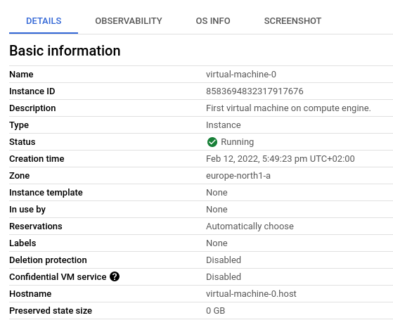
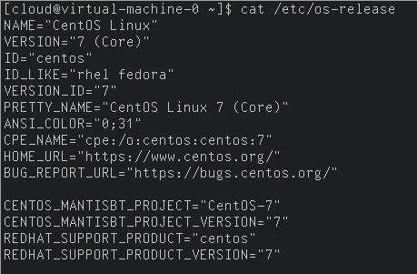

Afterwards I have created a new snapshot of this machine in storage section:


While creating the VM, I had an option to create and attach additional block devices.
The process for doing that separately is essentialy the same.
So I added additional 10GB disk.
I also recieved a warning that the disk is unformatted, and so I had to create partition table and write filesystem separately:

```shell
# fdisk /dev/sdb
# mount /dev/sdb1 /mnt/
```

Then I wrote some data onto it and proceeded with the task.

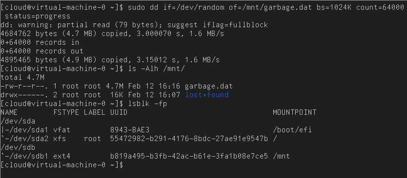

First, I created a second VM from snapshot of the first VM:

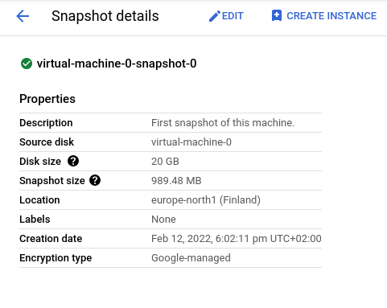
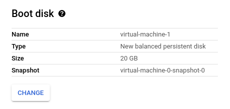
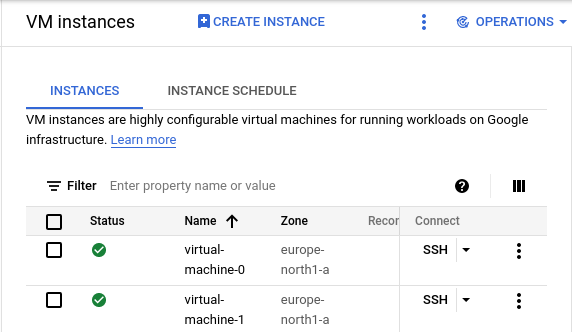

In order to proceed with task 2.2.8 I unmounted disk from VM 1, went to console, detached the disk from VM 1 and attached it to VM 2, then I mounted as usual.

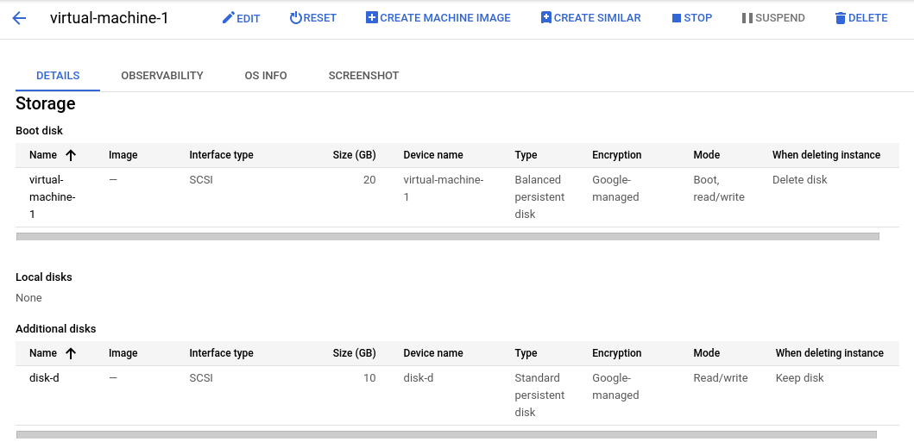
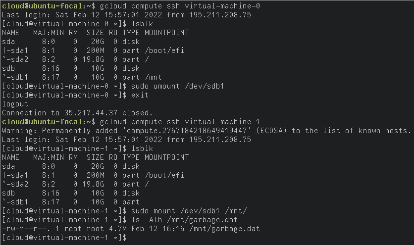

## Task 2.2.9

GCP's free tier quota does not allow working with domains, and quota increase is not possible at this point.
Still, GCP's documentation describes working with Google Domains (not available in Ukraine) as well third-pary domains.

## Task 2.2.10

Setting up basic wordpress website can be done through google's *click to deploy* service for wordpress.
Setup took me throug a few configuration options, and eventually deployed a signle VM instance running wordpress.

Afterwards, all credentials were available through deployment manager panel:

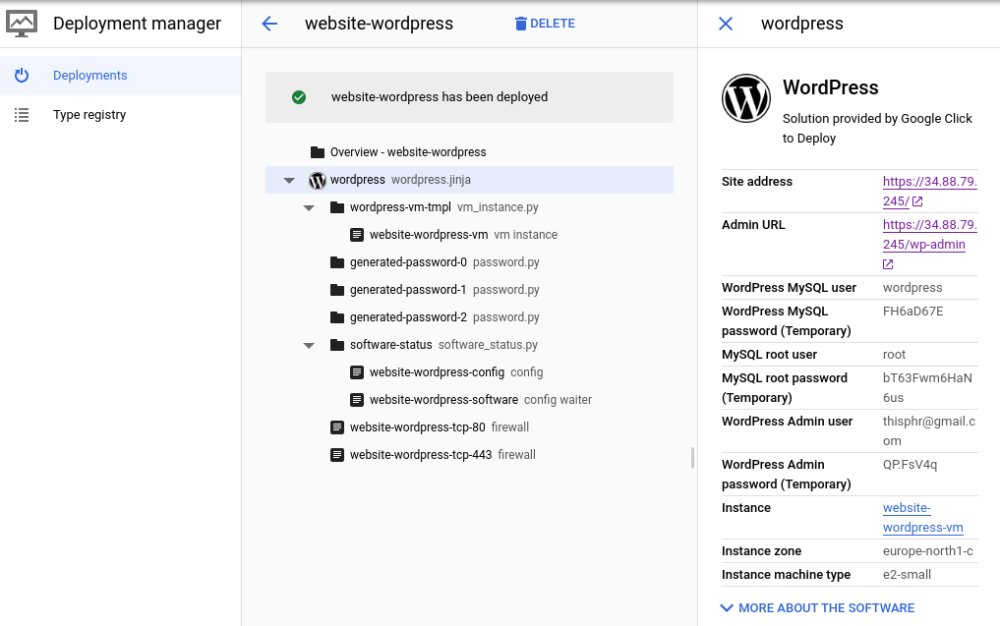

Deployment automatically sets firewall rules to allowing connections on `tcp:80` and `tcp:443`.

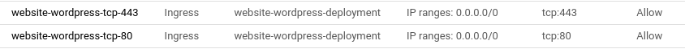

Therefore, at this point the website is already available on the Internet
Next step was reserving static IP for this particular VM instance:

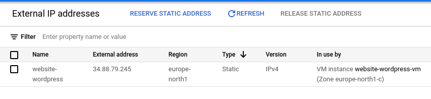

And the rest of configuration could be done via assigning A and/or AAAA DNS records to this adress.
Then sshing into the machine or provisioning a tls certificate:

```shell
# apt update && apt install certbot python3-certbot-apache
# certbot run
# crontab -e
```

and in crontab:

```cron
0 0 1 * * certbot renew
```

## Task 2.2.11-12

Creating, uploading and retrieving is straightforward.

GCP offers *Cloud Storage* service for object storage.
So I created a simple bucket and uploaded some source code there.

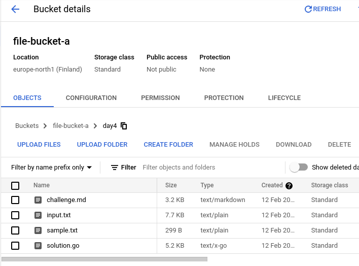

Afterwards, these files are accessible either through console's download bytton, command line utility, or via the internet. But only if public access was enabled.

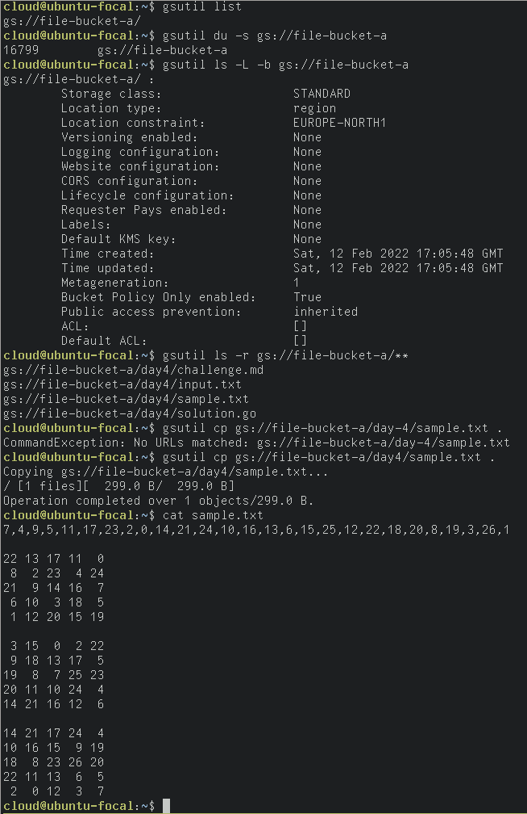
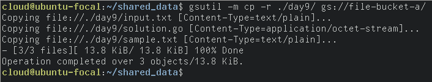


## Task 2.2.13

Google uses *Cloud run* service to deploy containers. I used [this](https://cloud.google.com/run/docs/quickstarts/build-and-deploy/python) quickstart guide to deploy a container service. Fully managed and scaled by the cloud.

First, I created a project directory to run in the container. Created the required files: program and Dockerfile.

Then, `gcloud run` command took me through an interactive prompt:

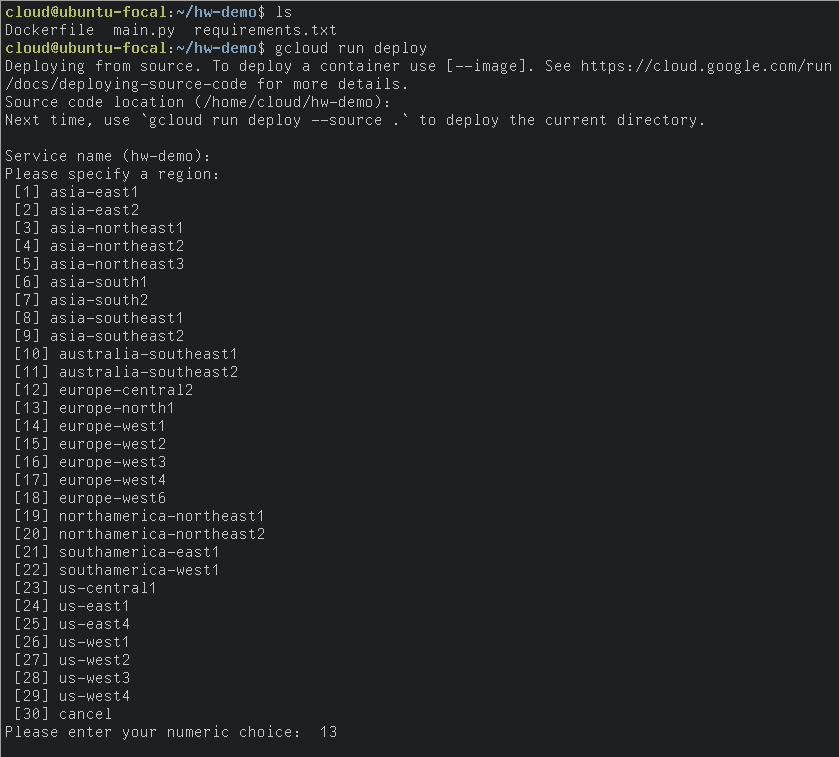

And with permission to allow unauthorized traffic, the app was accessible on the Internet:

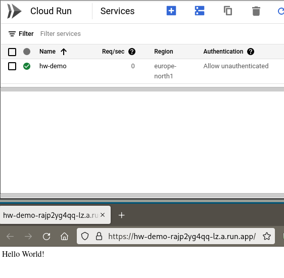

What this does, is it sets up a bucket containing source code for this program, then runs Cloud Build, that builds the container for the actual Cloud Run service to run.

There also a solution using GKE.
It is [mentioned](https://cloud.google.com/free/docs/aws-azure-gcp-service-comparison) in the official documentation as the competitor product of ECS.

Unfortunately, after a few hours of troubleshooting, I wasn't able to set it up...
Just as I was typing previous sentence, docker build, completed without errors. It appears that I have mistyped build tag in cli.

Afterwards, creating a cluster for the app and deploying it was relatively straightforward:

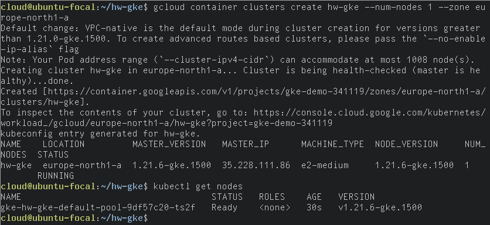

As well as creating a service, and finally getting access via external endpoint:

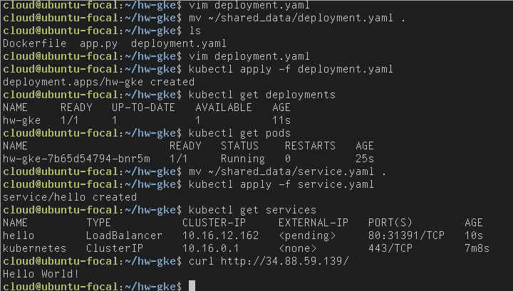

# Task 2.2.14

A serverless application requires google's functions_framework package (python). Program that uses that package is then deployed via `gcloud deploy <name> --runtime <language> --trigger-<type> --allow-unauthenticated`:

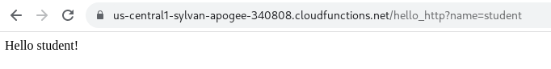

# Task 2.2.15

Finally, I created a [webpage](https://storage.googleapis.com/444-staticpage-at-gcp/index.html) with GCS. Google Domains is also a non-freetier service, and unfortunately my registrar didn't offer free domains.

And this concludes Task 2.2.
