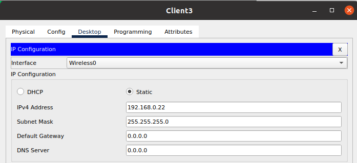
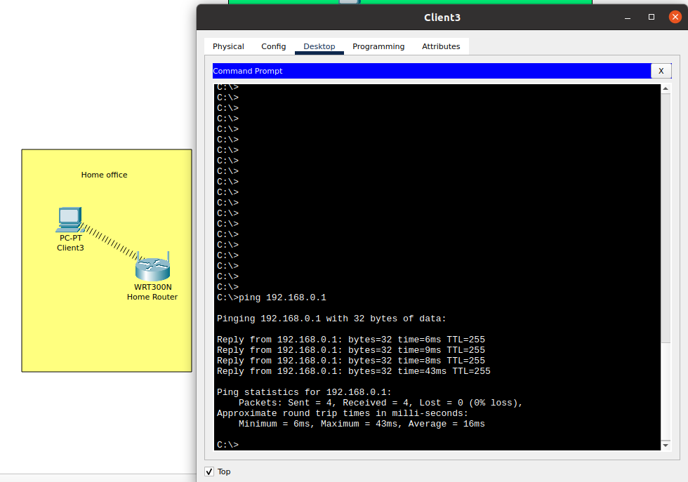
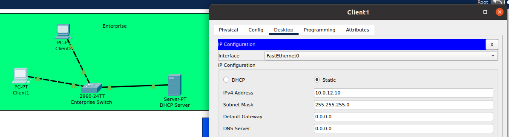
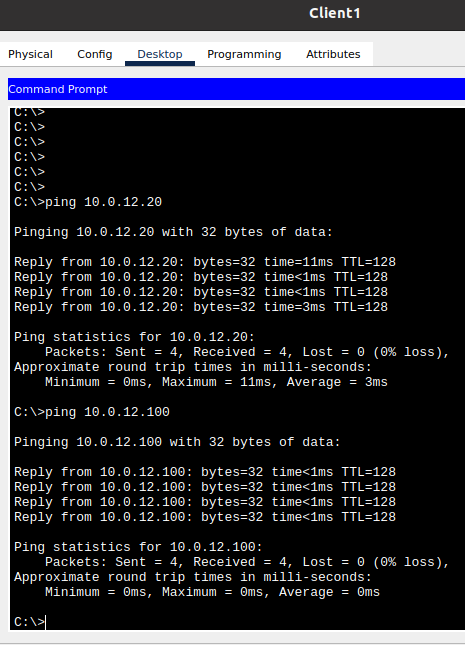
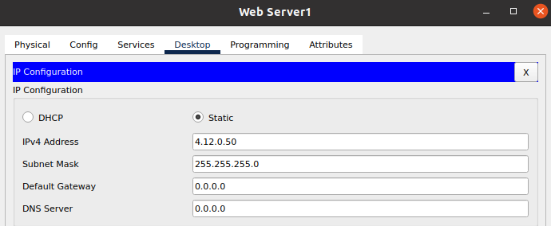
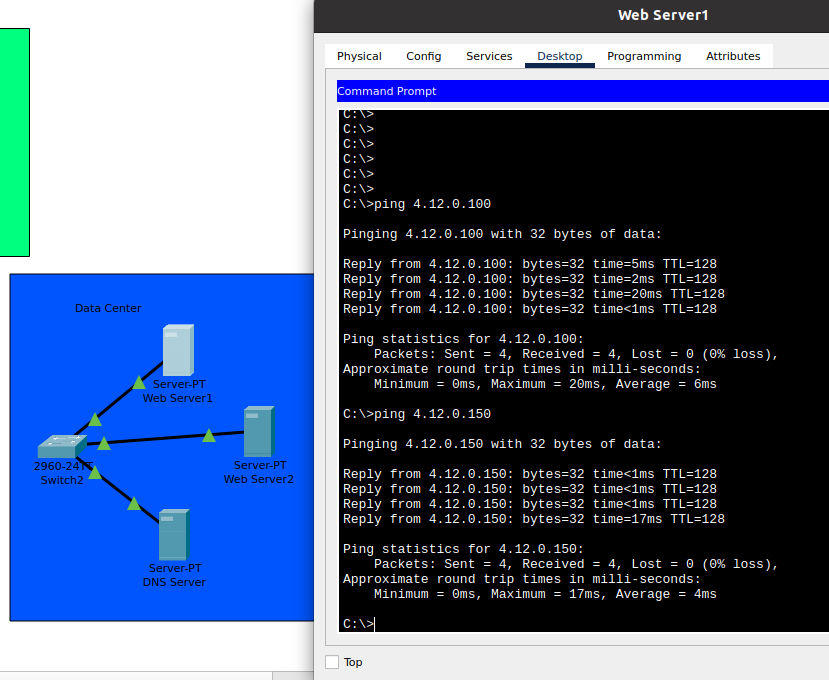
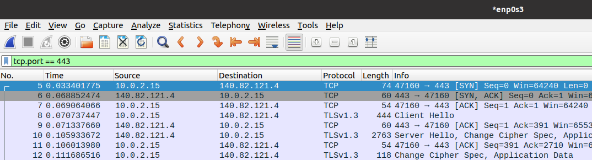
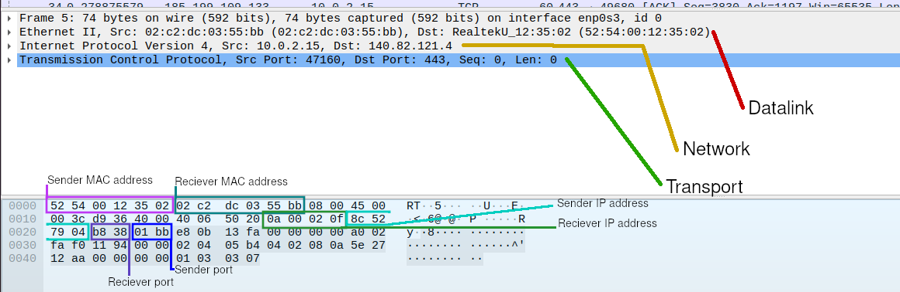

# Task 3.1

For the first task in the module, I have created 3 areas in logical view:

1. Data Center
2. Enterprise
3. Home office

Naming:
- D = 12
- M = 4
- Y = 0

Home office
-----------

For Home office, I had a PC connected to a wireless router.
Unfortunately, in orded to connect to the network, Packet Tracer required me to use network module different from what was described in the task. Otherwise it wouldn't connect.

First PC recieved static IP of `192.168.0.22/24`:

And that computer was ready to ping the gateway:

Enterprise
----------

Enterprise enetwork consisted of 2 PCs, a switch and a DHCP server.

This network's subnet is `10.0.12.0/24`.
Hence Client1 IP address of `10.0.12.10`:

This client can then ping Client2 at `10.0.12.20` and the DHCP server at `10.0.12.100`:

Data Center
-----------

Finally, Data Center has 2 webservers, a switch and a DNS server.

With Web Server 1 at `4.12.0.50`

we can then reach all the other devices on the network:

Additional task
---------------

After installing and downloading wireshark, I started listening on `enp0s3` interface while downloading some binaries from github.

After the download was complete, I filtered out everything except `tcp:443` and began inspecting the first SYN request:

Here is the data found in this TCP packet:

- sender MAC: `52:54:00:12:35:02`
- reciever MAC: `02:c2:dc:03:55:bb`
- sender IP: `140.82.121.4`
- reciever IP: `10.0.2.15`
- sender TCP port: `443`
- reciever TCP port: `47160`

Where reciever is me, and sender is github server.

Thus concluding task 3.1.
