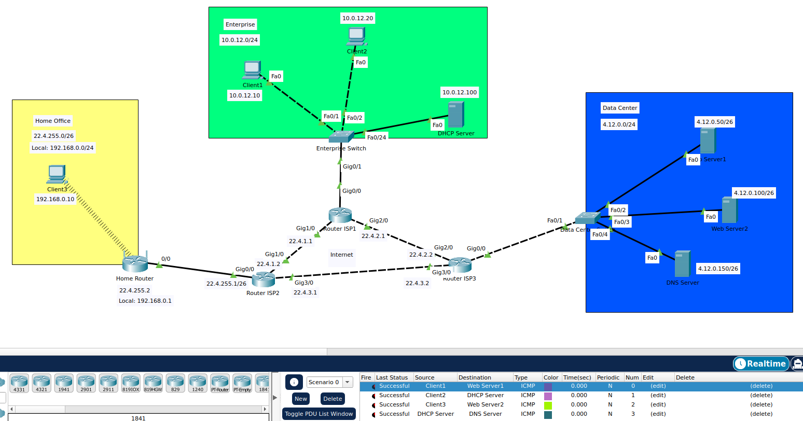
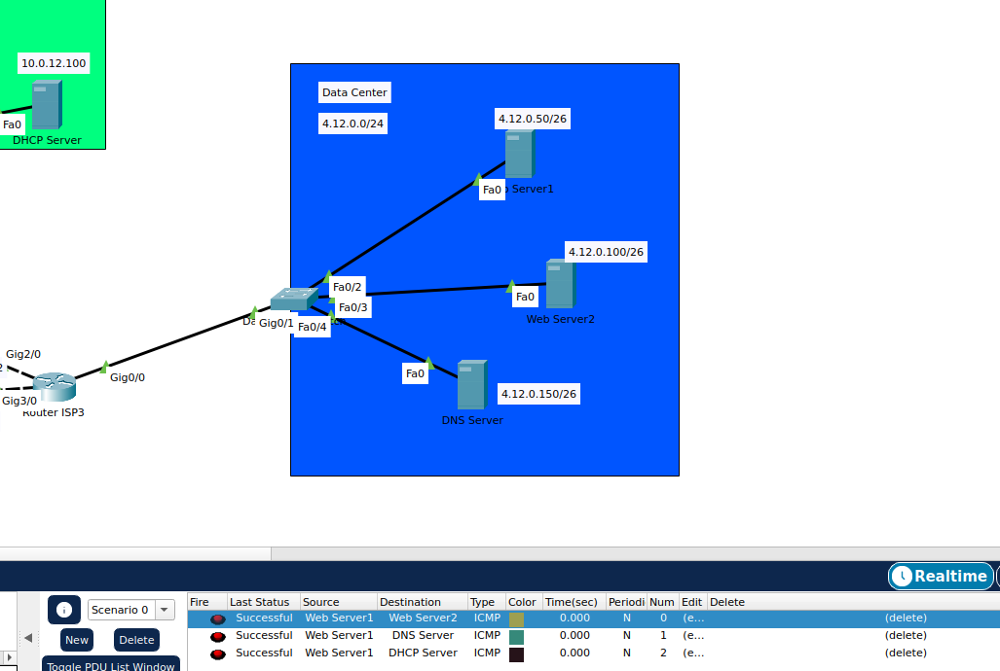
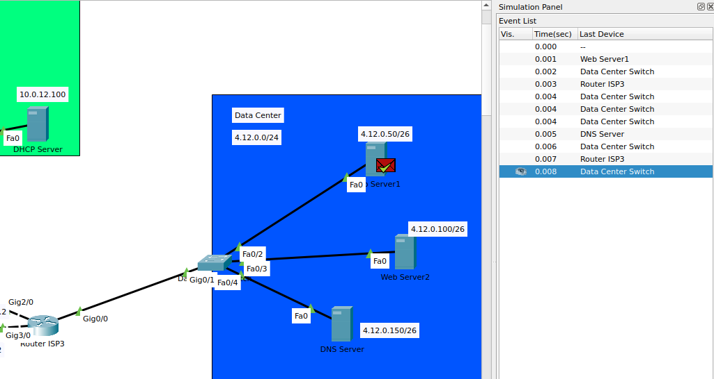
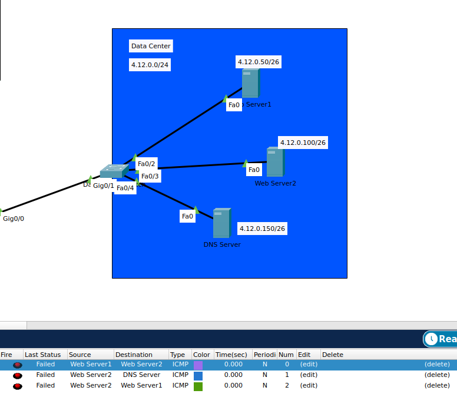
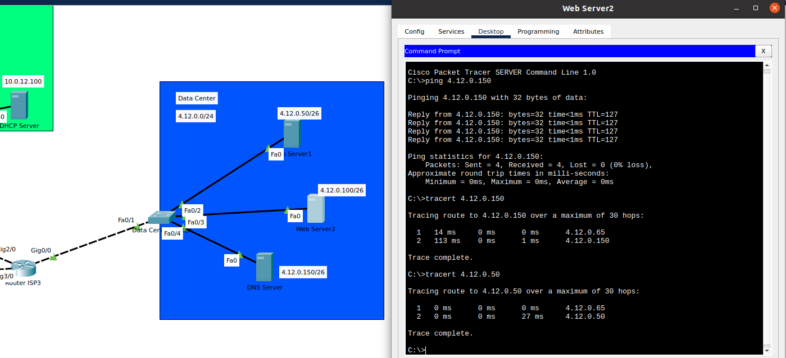

# Task 3.2

After creating 3 networks it was time to connect them with routers.
First, I added 3 routers each corresponding to the ISP routers in the task.
Then, connected networks to their respective interfaces on routers and switches so that Gig0/0 always connects to the network they're directly adjacet to.
I then assigned IP addresses from `22.4.0.0/26` to 2 additional ports connected to other routers.

Next step was creating static routing tables for each router.
Every interface had to be in the same network in order to route traffic in and out.

At this point, the network was ready to be tested for connectivity.
All devices can reach each other, as indicated by ICMP packages on the bottom left side of the screenshot:

The only exception is Client 3, since it sits behind a private network created by the Home Router.

Additional task
---------------

I first assigned each device in the Data Center subnet mask of `255.255.255.192` or `/26`.
This divides the network into subnets of exactly 1 device.

This doesn't break the connection, as seen on this screenshot:

This, however, requires the packet to be sent to the router, back to the switch and then broadcasted over the network as indicated below:

This would create a lot of unnecessary traffic on the network.

Proceeding with the task, I added VLANs to the switch and assigned the appropriate interfaces to those VLANs.

As expected, this broke the network, and no connectivity was possible between the devices:

To configure VLANs, I changed switche's gateway interface to trunk mode and proceeded with configuring the router.

Afterwards, Data Center was back online:

