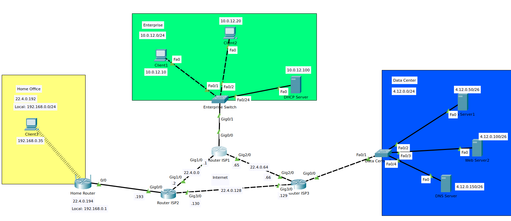
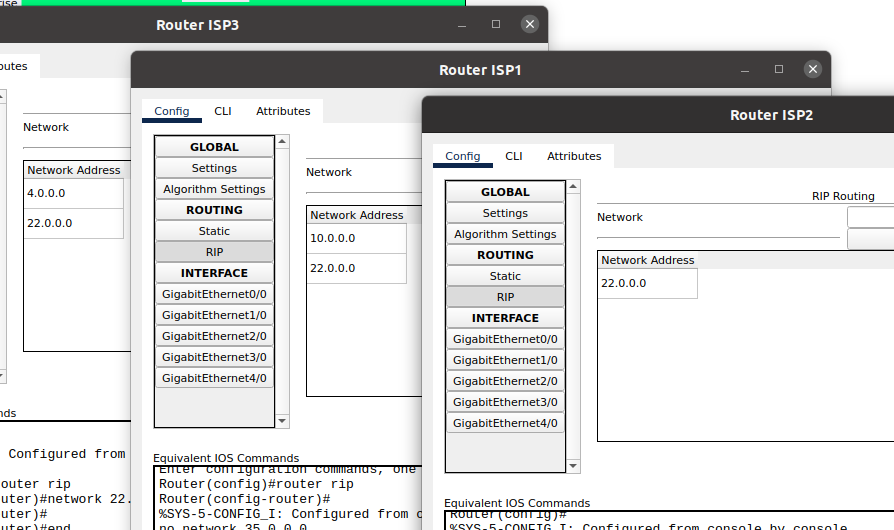
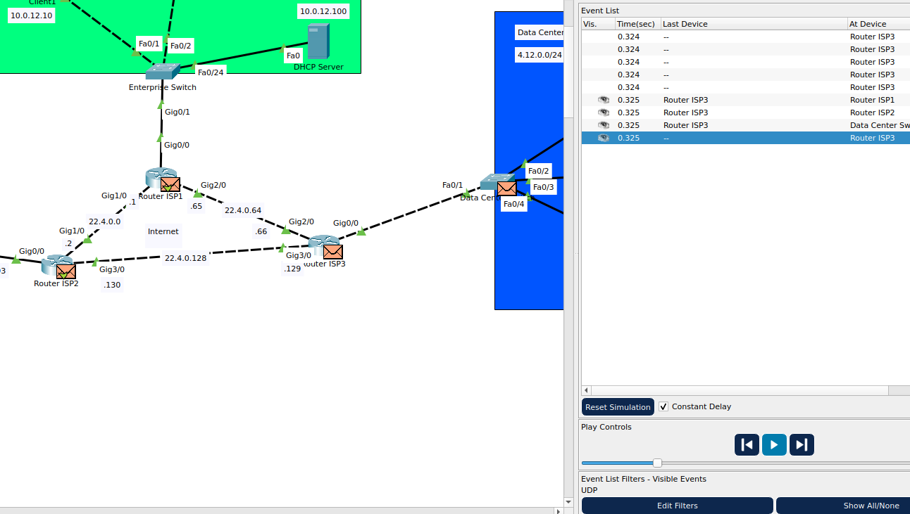

# Task 3.3

For this task I already had static routing set up in previous tasks, however I had to fix subnets.
Specifically home router's IP address to be in range of `22.4.0.0/26` address range as well as each router port(adjacent to other routers).

With this setup, I then switched routers to RIP and added connected networks to their tables:

And now, in simulation mode, routers can be seen advertising networks to each other through udp packets:

