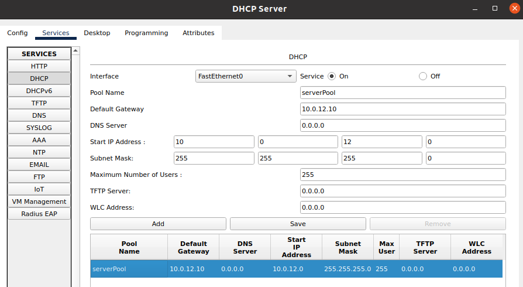
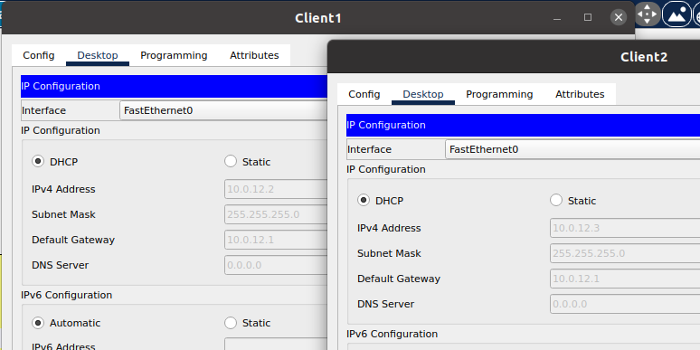
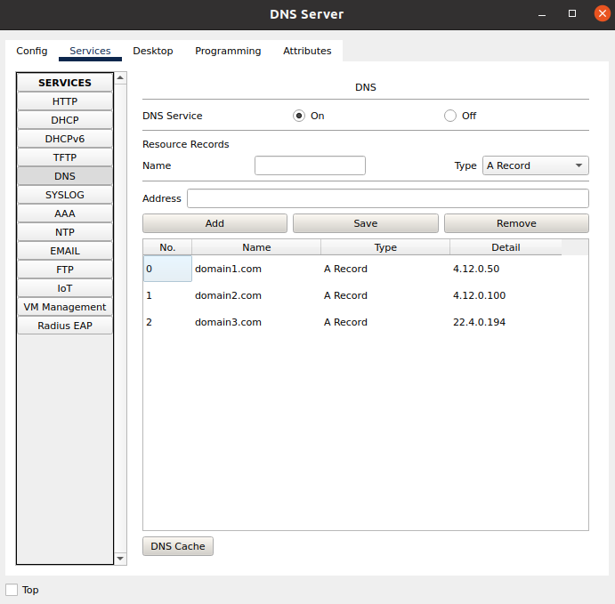
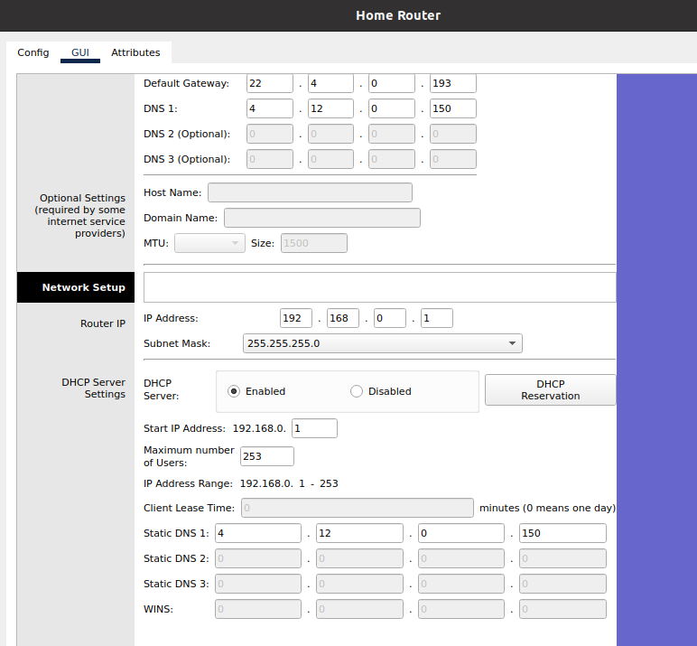
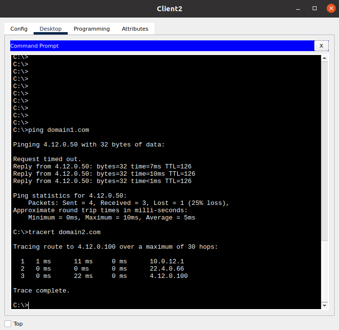
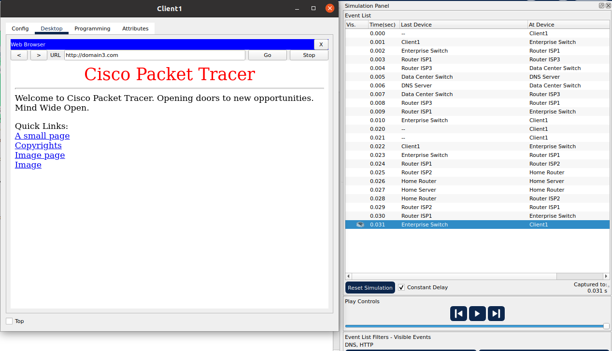

# Task 3.4

DHCP
----

For this task, I started with configuring DHCP server in Enterprise network:

And then enabling DHCP on both clients on the network, allowing the service to freely assign these devices IP addresses within `/24` range:

The same process applies for the home router, and can be seen in DNS enabling section.

DNS
---

I got on DNS server's configuration by assigning neighbouring servers their respective A record domain names:

Then, I added this DNS server to both of my DHCP servers, and reenabled DHCP on all clients:

And like this, Web Servers were accessible via their domain names:

Port forwarding
---------------

For homeserver, I first configured the server with a static IP address and a custom index.html file.
Then plugged it into the router and configured the router to forward http traffic to `192.168.0.100`.
Then, added a DNS record, tried opening domain3 on Enterprise network and recorded all DNS and HTTP traffic:

