# Task 4.1

## Part 1

Logging as root.
----------------

In order to log in as root into a guest system, I can choose several ways to do so:

1. Simply use root credentials to log in to the system at startup.
2. Use root credentials via an ssh connection, if sshd is running on this machine.
3. Log in as regular user and use `$ sudo su` (or `doas`) command to elevate priviliges, only possible if the user is in `wheel` or `sudo` usergroups and sudoers group is allowed to do so.

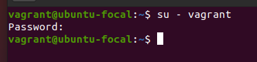

Use `passwd` utility.
---------------------

`passwd` utility can be used to change user's password or other users' passwords (as root).
Especially useful for administrators who may need to adjust password policy.
It also checks for basic password security.
`passwd` may modify the following system files:

1. `/etc/passwd` - basic information about users (including wether or not user has password set)
2. `/etc/shadow` - the passwords in question, encrypted
3. `/etc/pam.d/passwd` - `passwd` config for PAM. I believe this is not actually modified by the utility.

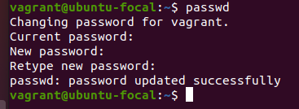

Determine registered users.
---------------------------

There are various utilities that can be used to determine registerd (and/or active) users.
For a basic list of all users, including system users, one can just inspect contents of `/etc/passwd`, where the first string before colon is the username.
Additionaly, the file contains information about their shells, uid(wether it's root/system/regular), password status.

For more information on what commands a user runs, one can use `$ w` command.

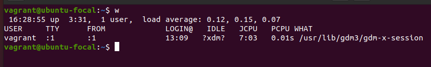

It displays username, `tty` (virtual display), origin host(if ssh'ing), login time, time used by processes attached to the tty and by the process in the adjacent filed(frankly, I have very little understanding of how this time is mearsured and what exactly it represents), and what command their shell is executing.
If GUI is being used, this will most likely be the graphical server (like `X11` or `Wayland`) with the graphical server then spawning all the other processes like on the screenshot.


Changing personal information.
------------------------------

Personal information could be useful for shared systems with multiple users.
One can use `chfn` utility to change personal data in the system.
Either by rinning a command with a flag.

Or by answering prompts.

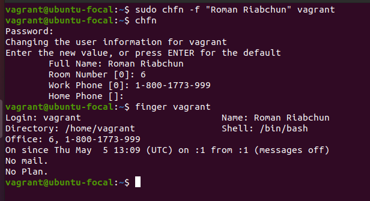

Using help system.
------------------

Linux distributions offer a variety of "help" commands that can be used to inspect documentation for other programs present on the system, as well as some miscellaneous documentation (for example libstd C if documentation is present):

 - `man`
 - `help`
 - `info`
 - also `apropos`
 - as well as simply running `$ cmd --help | less`

`man` and `info` are more or less the same and provide documentation for most of the programs installed on the system.
`man` displays so called "man pages", generated or written by the creators of the program and denoted with *.1, *.2, etc. file extentions.

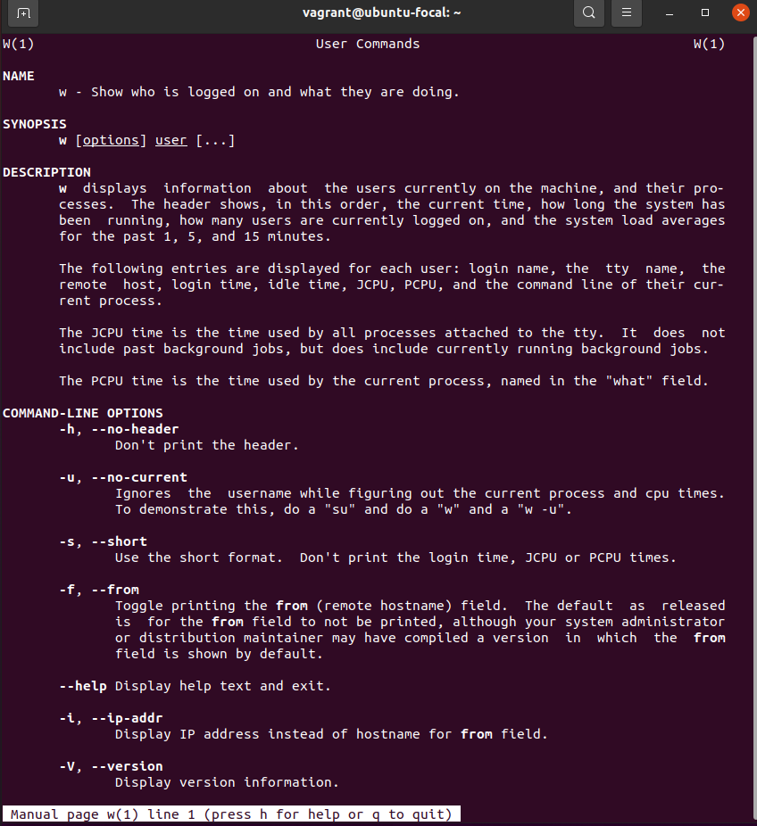

To my knowledge, `info` sometimes offers a more extensive documentation (for example, it displays the same documentation as the official GNU website for GNU utils).

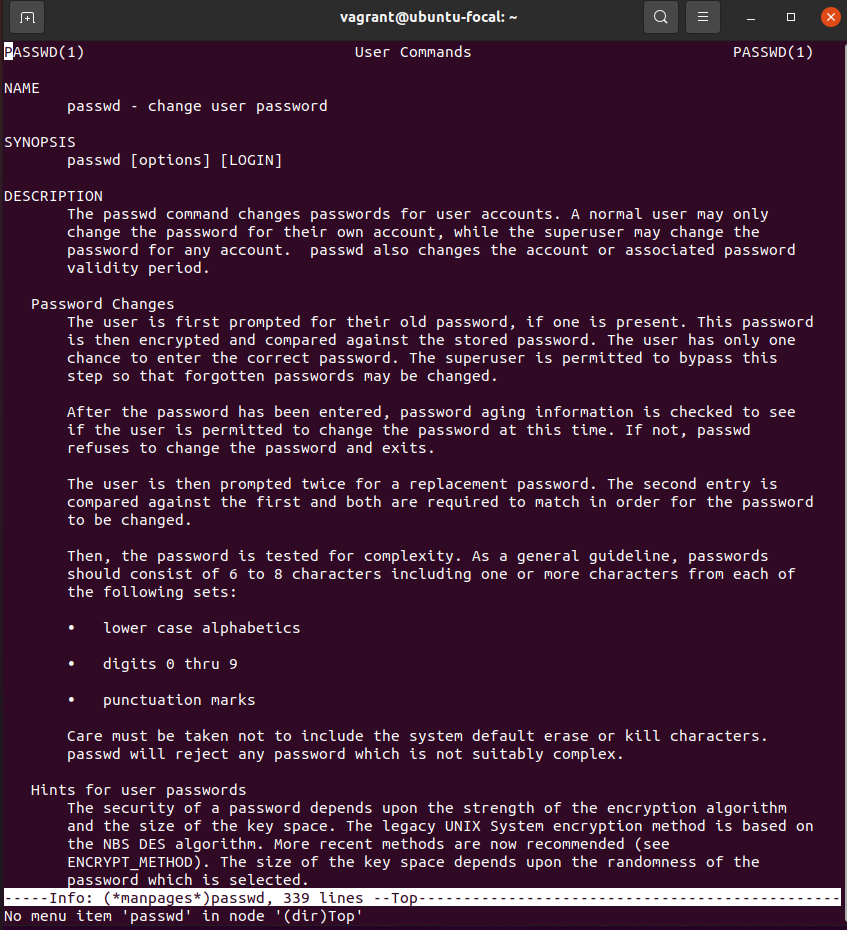

`help` provides explanations for bash builtins (like `[]`, `if`, `case`, `disown`, etc.)

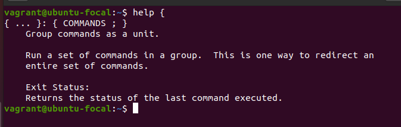

`apropos` is, in a way, a metasearch utility, that searches manpages for mentions of a keyword(technically a pattern) in the description. Has to be updated with `$ mandb`, which usualy run by installation hooks or cron.
Using it may be surprisingly fruitful, for example for navigating the `grep` strain diversity:

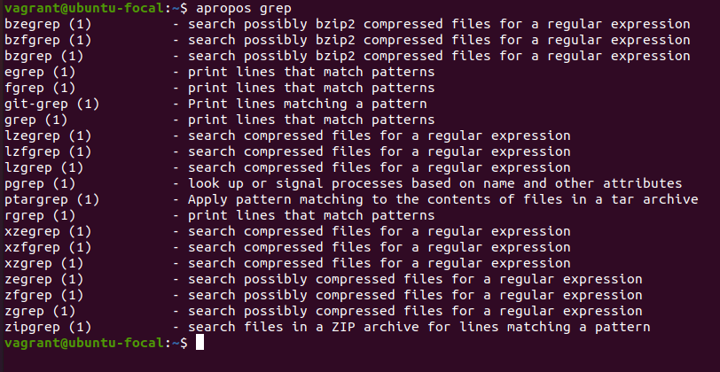

I am not entirely sure what the `two keys` means in the context of this task, but I would be glad to give examples, given I can get a clarification.
Will try to update this later.

The `less` and/or `more` commands.
----------------------------------

`Less` and `more` commands are more of a text readers, or so called pagers.
`less` is usually used by `man` utility to display text, but it can also be used to read `--help` output of programs that don't provide manpages.

`more` here is just another pager, that is more or less similar to `less`.

I took advantage of this, and made a little shell script that tries some of these methods for me:

```shell
function man() {
    command man "$@" && return 0

    command -v "$@" &>/dev/null && \
        "$@" --help 2>&1 | "$PAGER" && return

    {
        printf "Similar man pages:\n"
        printf "==================\n"
        command apropos "$@" 2>&1
    } | "$PAGER"
}
```

In order to inspect bash config files separately I ran:

```shell
$ less ~/.bashrc
$ less ~/.bash_profile
$ less ~/.bash_logout
... etc.
```

or all together:

```shell
$ less ~/.bash*
```

or even:

```shell
$ less ~/.bash{rc,_profile,_logout}
```

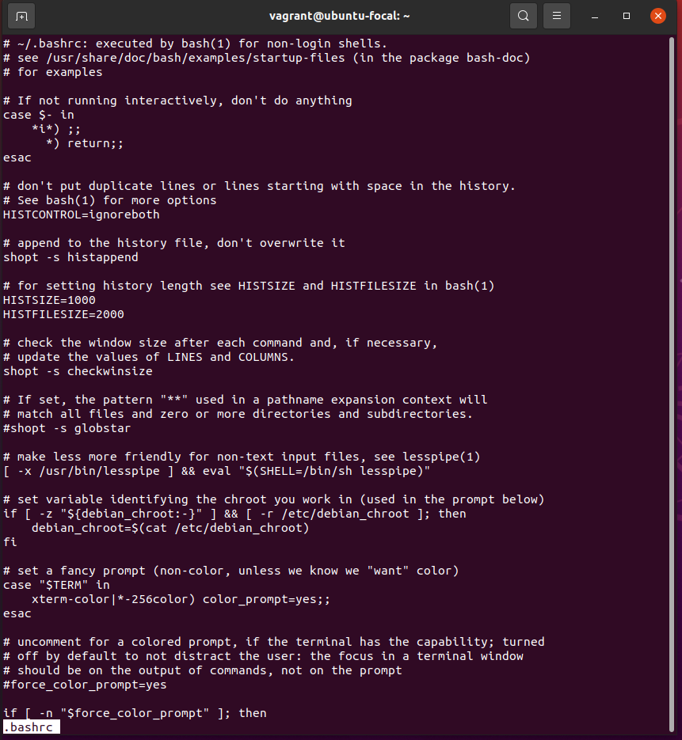

Last logons.
------------

Displaying last logons is intuitive, with a simple `last` command.

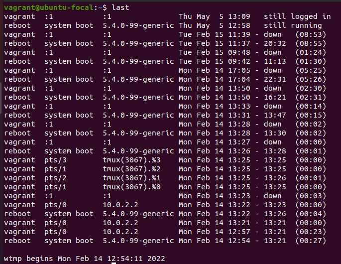

The command not only displays users and their login and out time, but also tty, host, and kernel.
The `lastb` is also a thing apparently, it displays bad login attempts. Which may be useful for security reasons in combination with `last`'s ability to display remote logins' hostname and IP address.

`finger` utility is also useful, as it's output is more human readable. It also displays only last logintime (and some additional personal info which is irrelevant for this task).

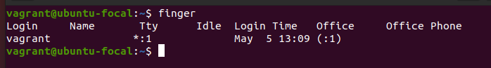

Listing contents of $HOME.
--------------------------

Looking at `pwd` is done via `ls` utility:

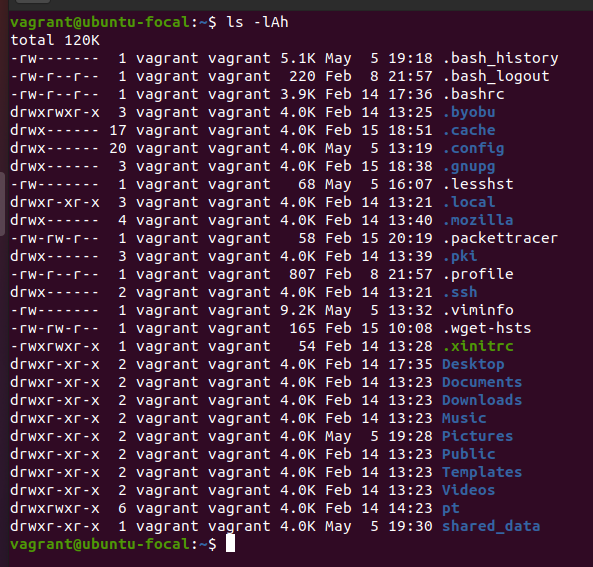

Here I use `ls` together with `-l` `-A` and `-h` flags.
This outputs the contents of the home directory (which could be specified if I wasn't in it already), otherwise specified as `$HOME` variable or `~` shell expansion.
The format is as follows:

1. Size of files at the top
2. File permissions (x reqired for directories)
3. Number of files inside
4. Owner
5. Owner group
6. Size
7. Last modification date and time
8. Name

Additionaly `-A` flag lists hidden directories except `.` and `..`
`-l` lists all the additional info
`-h` displays sizes in human readable format instead of bytes.

## Part 2

The `tree` command
------------------

Tree outputs a tree of directory structure in a neat visual.
The command, through it's flags allows me to control the output.
For exampe, in order to get all the files that contain 'c' character I need to enter:

```shell
$ tree -P *[cC]*
```

or

```shell
$ tree --ignore-case -P *c*
```

And for listing subdirectories up to a specific (instead of all) level, I'd need to enter:

```shell
$ tree -L 2
```


Determining filetype
--------------------

General file type can be determined via `$ file` command with the filename passed as argument.
For example: a binary executable (and it's type), a tarball, other archives, directories, ascii files (csv too), xml files(office files too).


Navigating filesystem
----------------------

I am already familiar with absolute and relative paths, as well as using `cd` to navigate the filesystem.

Relative paths refer to paths not beginning with `/`, which refer to root directory.
Instead it signifies a path which uses current working directory as it's "root".
It can not only refer to files velow working directory, but also ones above through `..` special directory, as well as itself with `.`.
Absolute paths begin with `/` or root directory and give the full path from root to the file that is being refered to.

Shell expansion of `~` helps with creating short absolute paths.
But it may cause some problems because it expands to home directory of the current user running the command.

If i'd like to return to the home directory, i could either just type `cd` or `cd ~`, the result would be the same.


The `ls` command explanations
-----------------------------

For the ls -l and -a flags explanations please refer to the first part of this task.

The only remark here is that `-a` displays `.` and `..` directories, while `-A` displays the same output as `-a` but without the special directories.
