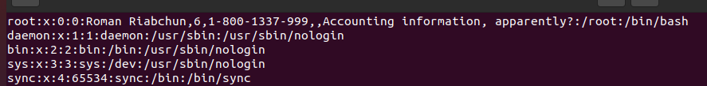
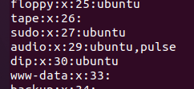
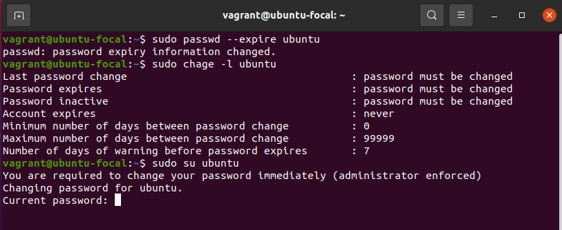
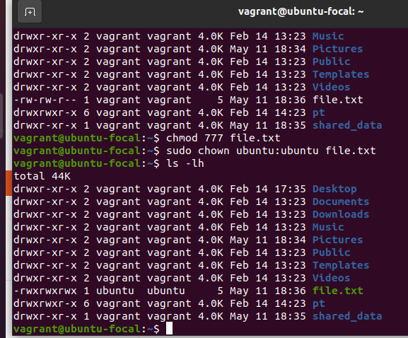
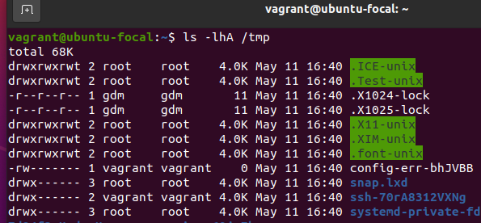

# Task 4.1

/etc/passwd and /etc/group files
--------------------------------

/etc/passwd and /etc/group contain information about users and groups respectfully.
They both contain data in a colon (and coma) separated values.



The format here is as follows

```
username:pasword?y/n:User ID:Group ID:User data(GECOS):homedir:shell binary
```

The system has several types of users, regular ones, system users, and root.
The root is just like the regular user, but obviously has the highest level of priviliges available.
The rest of them are pseudousers, or system users.
These are users that run certain programs that do not require elevated priviliges.
In other words, they essentilay run as daemons that perform miscellaneous tasks.
Some of them are standard, like a bunch of systemd-* users, rtkit, avahi for networking, as well as sound or pulseaudio, docker, etc.
These usually have UID of `< 1000` and `> 0`.

The group file has similar format, and looks like this:



```
groupname:password?:Group ID:users
```


UID ranges and definitions
--------------------------

UID is a number given to each user on the system to identify them.
UID ranges are ranges of those numbers that define priviliges and purpose of a specific account.
UID of 0 gives the user, whatever the name, full priviliges over the system.
UID above 0 and below 1000 are system users, that perform service of the OS and the programs that it runs.
UID above 1000 are regular users, that are usually confined to their home directory and don't need to do any heavy lifting, such as installing programs or accessing important system information.
Of course with exception of sudoers.

GID is the same idea as UID but applied to user groups identification.


Determining belonging of a user
-------------------------------

User may have a primary and secondary groups, both of which are valid groups.
One can either find all users of a specific group in /etc/group, in /etc/passwd (primary group), or via `id` command.

```shell
$ id ubuntu
```

Adding user
-----------

In order to add a user to the system, one can either use `adduser`, or a `useradd` command.

I to do so, I would use

```shell
# useradd -m newuser
```

All one needs to create a new user is root priviliges and a username.
The other parameters may be added if needed (`-r`, nologin shell, and no `-m` for system users; `-G` for additional groups, UID, GID, comments, password)

If using `adduser`, one may need to configure the defaults, or otherwise specify similar flags for a regular user.
Similarly, `--system` flag is required for adding system users.


Renaming user
-------------

First, one needs to log the user out.
Then, run `usermod -l newname oldname` and rename mail spool, home directory, and gecos.


skell_dir directory
-------------------

skell_dir is a directory located in `/etc/skel`.
Skel refers to "skeleton directory", where all the default files are located and are copied to the user's home directory after it's creation.
All files in this directory are owned by root.

Removing a user
---------------

To remove a user I would run

```shell
# userdel -r user
```

Lockingg a user account
-----------------------

To do so, I can expire it's password, which would lock it.


```shell
# chage -E0 user
```

and then simply lock access:

```
# usermod -L user
```

Removing user's password
------------------------

To remove a password and prompt the user to change it, I would use

```shell
# passwd --expire user
```

This will simply expire the password and ask user for a new one as opposed to completely locking user out as shown in the example above.




Using extended info in `ls`
---------------------------

Answer can be seen in [task 4.1](../task4.1/readme.md), "Listing contents of $HOME."


Access rights
--------------

Access rights are displayed as a sequence of characters

```
- rwx rwx rwx
```

where

- r is reading rights, so accessig the contents
- w is wrighting rights, or modifying the file
- x is executing rights, which is for executing the file

And the first character signifies type of the file:

- "-" for regular files
- "d" for directories
- "b, c, p, etc." for other types such as devices or pipes and sockets

Each row of rwx show permissions as follows:

```
"all users" "group owner" "user owner"
```

So `-r--rw-rwx` means that all users can read the file, members of the group that owns the file can read and write to it, and user owner of the file can read, write and execute it.

NOTE: execution rights are required to read contents of a directory, which came to me as a surprise.


Sequence of defining relations between user and the file
--------------------------------------------------------


Commands to change owners of a file and mode of access
------------------------------------------------------

We can use 2 commands to change these parameters: `chown` and `chmod`.

To change owners one can simpy use

```shell
$ chown new_owner file
```

likewise, to change user and group

```shell
$ chown new_owner:new_group file
```

And for changing the group just omit the user (`:new group`).


To change permissions, I can enter

```shell
$ chmod ugo+rwx file
```

where
- `ugo` means that we want to modify Users, Group, and Owner permissions. Or use `a` instead
- `+` means that we want to give permissions, otherwise use `-`. To reset permissions and only leave the ones mentioned by the command, use `=`.
- `rwx` means that we want to grant everyone full permissions to read, write, and execute. `t` is also available and is used to set sticky bit for the file.

Also these can be coma separated -- `$ chmod a+r,go=wx file`.



Octal notation
--------------

Another way to use this command is in octal mode, where one can set permissions for each group in a form of a set of 3 digits from 0 to 7.
So `chmod 750 file` would grant Users `rwx` permissions (7), Group `r-x` permissions (5), and the Owner `---` permissions (0).


So this brings us to octal representation, which works the same way as described above.
On a lower level, octal format perfectly represents 3 modes of access for each user:

```
r/w/x | binary | octal
 ---  |  000   |   0
 --x  |  001   |   1
 -w-  |  010   |   2
 -wx  |  011   |   3
 r--  |  100   |   4
 r-x  |  101   |   5
 rw-  |  110   |   6
 rwx  |  111   |   7
```

As we can see from this table above ([credit](https://www.baeldung.com/linux/chown-chmod-permissions)), three bits that represent octal numbers correspond to the afforementioned permissions.

`umask` command is used to check and set default permissions for new files.
It works by setting a certain value (4 digit sequence), which represents permissions that we don't want to give when creating files.

1st digit represents sticky bit, and the rest is the octal notation.
Default permissions can then be calculating by substracting each digit from max permissions (`666` for files and `777` for directories).

Therefore, the default permissions (umask `0002`) for files is `664` or `rw-rw-r--` and `775` for directories or `rwxrwxr-x`.


Sticky bits and id substitution
-------------------------------

Sticky bits are a feature that allow the system to only allow change and deletion of a file to it's owner.
This is mainly used in `/tmp` directory to prevent other users and processess to delete files used by other processess.



TODO: learn more on what id subsistution is.


File attributes
---------------

File attributes are another feature that further describe operations allowed by the filesystem.
These are all optional and simply describe some additional customization made by the user.
For example, if one wants to make a file that is likely to be corrupted, one can enable journaling with `chattr +j file` or to prevent overwriting, add append only attribute with `chattr +a file`.
