# Task 3

## Part 1

States of a process
-------------------

A process in a linux system can exist in 5 states.

- running -- simply executing
- stopped -- suspended until either terminated or continued
- uninterruptable sleep -- waiting for resources requested by the process to become available, does not react to signals
- interruptable slepp -- same as the previous one, but does react to signals
- zombie -- execution finished and the process is waiting to be removed from process table

There are some others, as seen in PROCESS STATE CODES in `ps` manual but they are mostly obsolete.


Pstree command
--------------

`pstree` command displays the tree of processes.
The root is always pid 1, which is the init system.
It then spawns children processes, one of which is graphical interface where the terminal application with bash is running and executing pstree command:

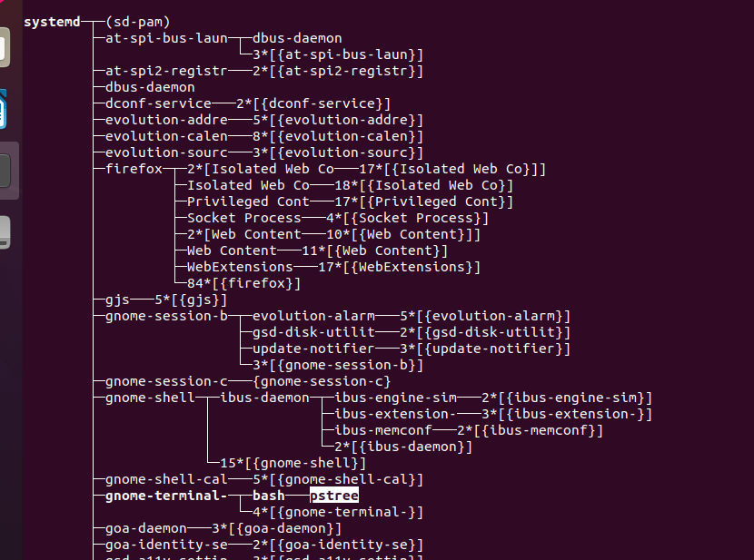

Here, with enough effort, one can see this path higlighted.


Proc directory
--------------

`/proc` is a directory containing data about processes running on the system as well as about some hardware (CPU, RAM).


CPU info
--------

We can use `/proc` directory to find out more about our CPUs via `$ less /proc/cpuinfo`.

```
processor	: 0
vendor_id	: GenuineIntel
cpu family	: 6
model		: 78
model name	: Intel(R) Core(TM) i3-6006U CPU @ 2.00GHz
stepping	: 3
cpu MHz		: 1991.998
cache size	: 3072 KB
physical id	: 0
siblings	: 3
core id		: 0
cpu cores	: 3
apicid		: 0
initial apicid	: 0
fpu		: yes
fpu_exception	: yes
cpuid level	: 22
wp		: yes
flags		: fpu vme de pse tsc msr pae mce cx8 apic sep mtrr pge mca cmov pat pse36 clflush mmx fxsr sse sse2 ht syscall nx rdtscp lm constant_tsc rep_good nopl xtopology nonstop_tsc cpuid tsc_known_freq pni pclmulqdq ssse3 cx16 pcid sse4_1 sse4_2 x2apic movbe popcnt aes xsave avx rdrand hypervisor lahf_lm abm 3dnowprefetch invpcid_single pti fsgsbase avx2 invpcid rdseed clflushopt
bugs		: cpu_meltdown spectre_v1 spectre_v2 spec_store_bypass l1tf mds swapgs itlb_multihit srbds
bogomips	: 3983.99
clflush size	: 64
cache_alignment	: 64
address sizes	: 39 bits physical, 48 bits virtual
power management:
```


Using `ps` command
------------------

Ps is very flexible with it's output and can be customized according to flags given to the command such as:

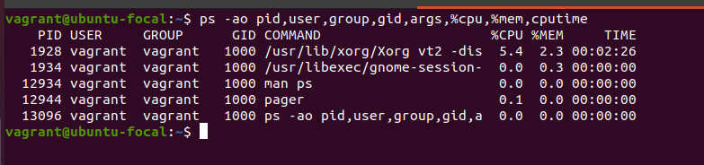

Here the command outputs pid, owner and their group (+id), and specific command that was used to launch it.


Kernel and user processess
--------------------------

A user process operates within virtual resources allocated by the kernel and within userspace.
These are essentially all the processes that we had to deal with so far, since init process is also a user process.
A kernel process is instead works in kernel space and has access to all the resources of the kernel, like hardware, devices and drivers.
Usually used during when system boots.


Printing states of processes
----------------------------

Below we can see a tree of processes with their respective states:

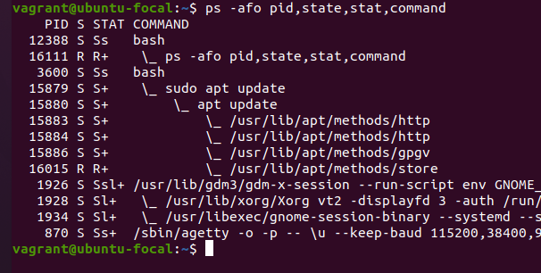

Most of them is currently in interruptable sleep state (S), with only 2 of them running (R), which are one of the `apt update` processes and the `ps` command.


Only a specific user's processes
--------------------------------


One can display that with

```shell
$ ps u$USERNAME
```

Where username is passed after `u` without any whitespaces.


Utilities to analyze running processes
--------------------------------------

One can use standard or otherwise utilities to look at the running processes.
One of which is `top`, or sometimes linux distributions come with a more readable `htop` utility preinstalled.

`ps` manpage also suggests using pgrep (for searching processes), already familiar `pstree` and simply accessing `proc` directory.


`top` information
-----------------

`top` utility describes system information at the top, like uptime, n of users logged in, summary of processes and their status, cpu load and memory stats.
Beneath is the actual ps output neatly formatted and constantly updated.

by default we get `pid,user,priority,nice,virtual memory,resident memory,shared memory,status,%cpu,%mem,time,command` format.


Filtering by user
-----------------

In order to filter processes belonging to a specific user, I can press `O` to create a new rule and then enter the rule such as `USER=username`.

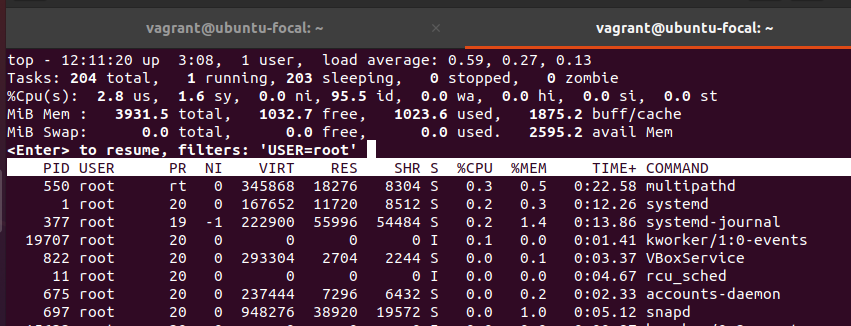


Interactive commands
--------------------

Top can be configured with interactive commands, which are simply keybindings.
There are some that allow for us to change the layout (such as `A` - alt layout, or `X` - change width, `V` - display proc tree) or to control processes (for example sending signals with `k`).

If I wanted to close the `top` utiity, I could use `q` command and just quit, OR use `k` to send SIGTERM(15) to pid 0 (interpreted as `top`).


Sorting task window
-------------------

`top`'s manpage provides a neat cheatsheet for sorting by the main parameters.
For example to sort prcesses by time that they have been running, one can press `T`.
Here is an example of sorting by CPU usage:

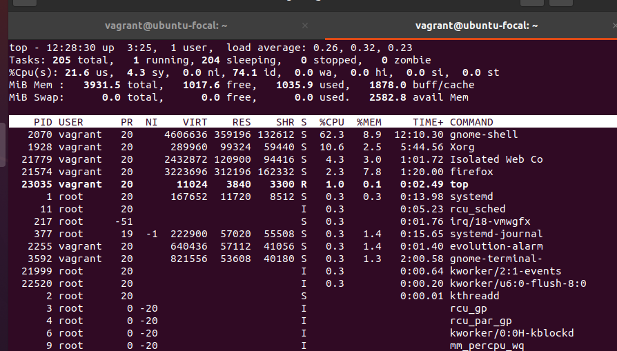


Priorities
----------

Priorities, or rather priority values, are values that denote how important a process is and therefore how to handle allocation of resources to it compared to other processes.
If the system doesn't have enough resources to run all of them at the same time, it has to instead "ration" CPU time for each one.
In linux, priority is a number from 0 to 139.
It then compares each processes respective value to determine which one has to get more computing time.

Priority in userspace is managed through a "nice value", which is then factors in the priority value as `priority == (nice + 20)`.

To manage priority we simply need to assign higher nice value to a process, like:

```shell
$ nice -n 10 top
```

This would bring priority of `top` to 30 as compared to 20 as seen on other regular processes.

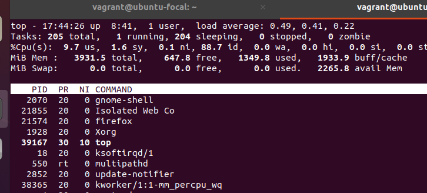

To change priority inside `top` one can use `r` interactive command, which stands for renice:

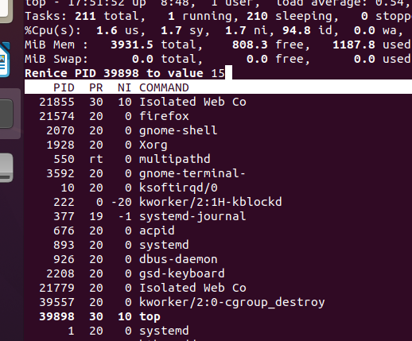

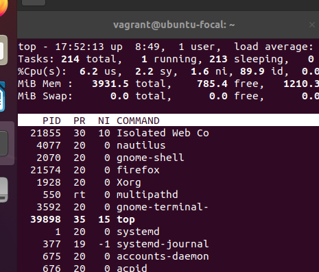


Sending signals
---------------

`kill` utility can be used to send signals to processes, and is also kind of like `ascii` utility in that it can list all the signals availabe on the system:

```
 1 HUP      2 INT      3 QUIT     4 ILL      5 TRAP     6 ABRT
 6 IOT      7 BUS      8 FPE      9 KILL    10 USR1    11 SEGV
12 USR2    13 PIPE    14 ALRM    15 TERM    16 STKFLT  17 CHLD
17 CLD     18 CONT    19 STOP    20 TSTP    21 TTIN    22 TTOU
23 URG     24 XCPU    25 XFSZ    26 VTALRM  27 PROF    28 WINCH
29 IO      29 POLL    30 PWR     31 SYS     34 RTMIN   64 RTMAX
```

The most interesting ones are SIGKILL, SIGINT, SIGTERM for terminating processes; SIGSTOP (or SIGTSTP to politely ask a process to stop) for halting; SIGCONT for resuming; and I wish to not see as many SIGSEGV in my life.

The most common and easy way to send a signal on most terminals is through `Ctrl+C` keybinding, that sends SIGINT to the running process and immediately terminates it (of course the program can also ignore it sometimes).

In a similar fashion `Ctrl+z` works as it sends SIGSTOP to the running process, which then can be resumed with `fg` command (or SIGCONT).

To send a signal with `kill` command, I could simply do

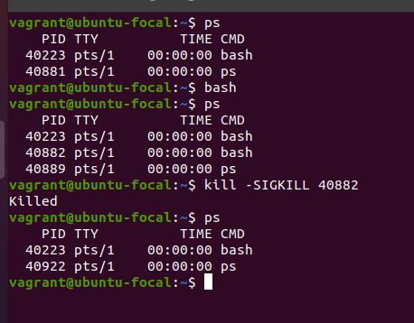

Here, bash would ignore or hesitate to respond to SIGTERM or SIGQUIT, so I had no choice but to kill it.
SIGSEGV can be used to intentionaly crash programs too.


Jobs, fg, bg, nohup.
-------------------

These can be used in a shell environment to manage multiple processes that are children of a single shell parent.

- `jobs -l` can display a list of children processes that are eiter running or sleeping.
- bg and fg stand for background and foreground and determine where the process runs. if I want a process to run in the background and not take over my shell I can send it there with `bg` or just append it with `&` at the end. `fg` just brings the process to foreground.
- and `nohup` is just a command that makes process ignore hangups typically sent when a terminal session is over and the system tries to terminate all it's children.

Here is an example of manipulating these jobs:

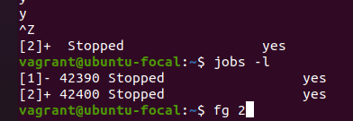
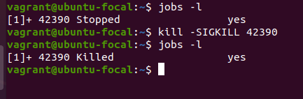


## Part 2
