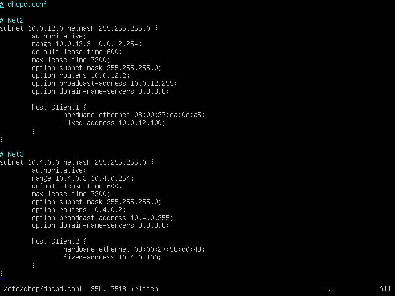
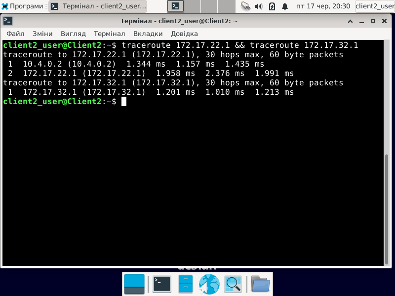
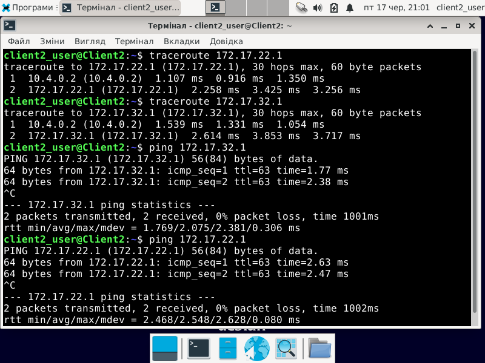
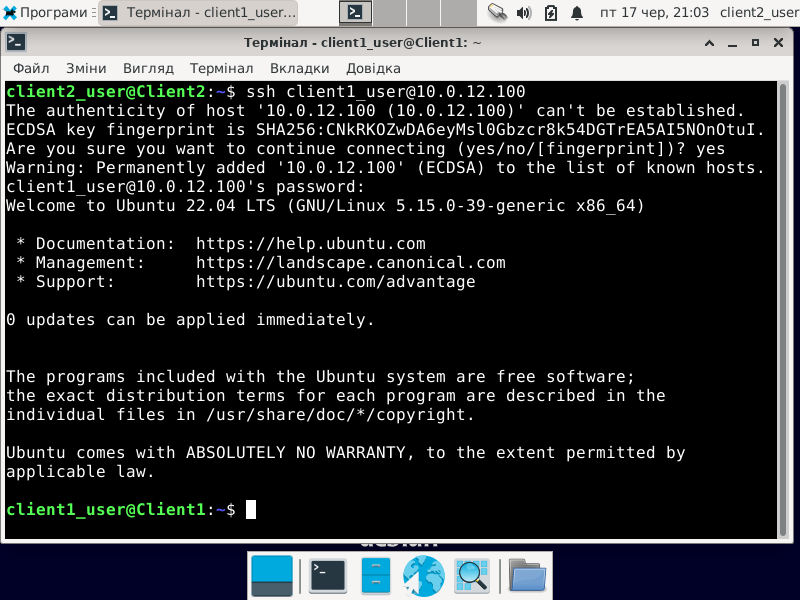
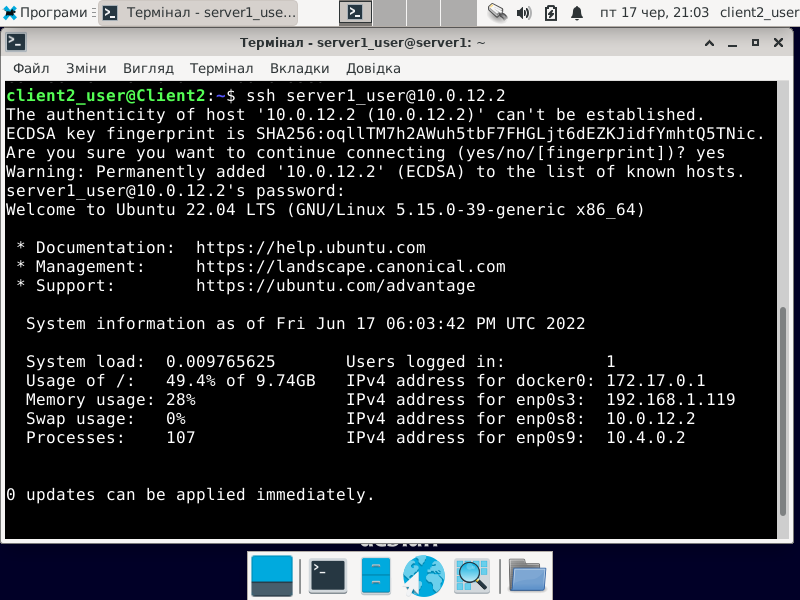
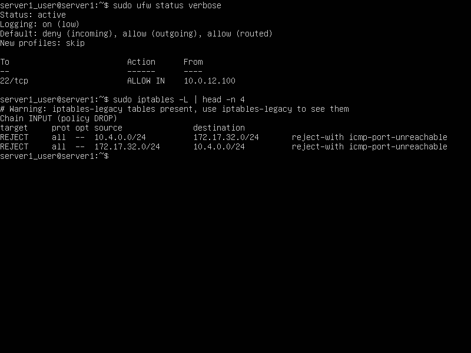
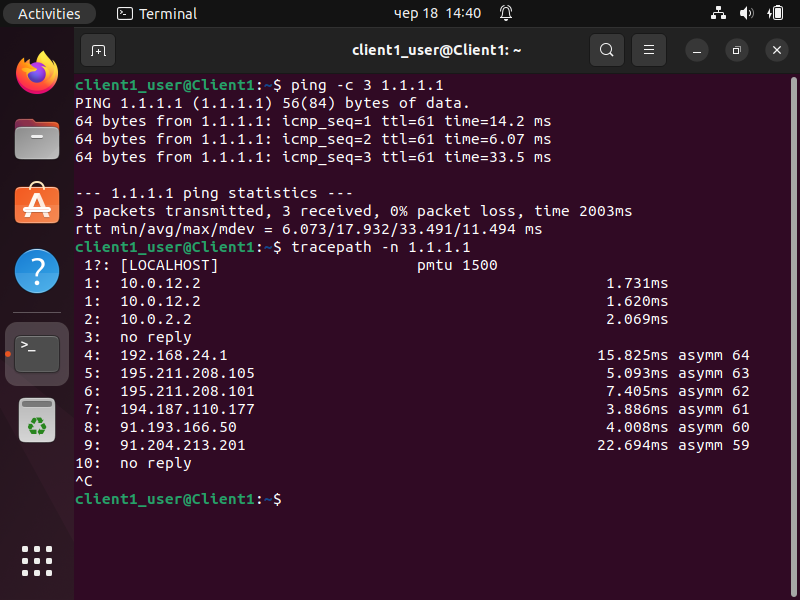

# Linux networking

For this task I began with setting up the server and the clients with respective addresses on the network interfaces:

- Srv1 (Ubuntu server):
- - enp0s3 -- 192.168.1.0/24 (Bridged); 10.0.2.0/24 (NAT, but later)
- - enp0s8 -- 10.0.12.2/24
- - enp0s9 -- 10.4.0.2/24
- C1 (Ubuntu desktop):
- - enp0s3 -- 10.0.12.100/24
- - enp0s8 -- 127.16.12.4/24
- C2 (Debian):
- - enp0s3 -- 10.4.0.100/24
- - enp0s8 -- 127.16.12.3/24


## 1.
I then configured network adapter addresses via netplan utility.

## 2.
Then, I installed `isc-dhcp-server` on the srv1 and configured each network in `/etc/dhcp/dhcpd.conf`. The only problem with such configuration is that static addresses should be out of range of lease address pool, but that doesn't impact dhcp's work much.


## 3.
icmp requests from C1 to C2 and vice versa do not work out of the box, unless directly allowed in `/etc/sysctl.conf`. This will allow traffic routing between interfaces, next thing to do is to configure static routes in `/etc/netplan/` for each interface.

## 4.
In order to complete task 4, one could either setup netplan on C1 to statically and persistently assign addresses for loopback interface, or temporarily assing with `ip address add 172.17.22.1/24 dev lo`. Then we'll need to recieve and route traffic from 2 interfaces to separate addresses on lo interface. Next, on C2, we can simply assign static routes to 172.17.22.1 through 10.4.0.2 (gateway at srv1) and 172.17.32.1 through 172.16.12.4 (enp0s8 at C2). Then the server should also know that 172.17.22.1 can be reached via 10.0.12.100 (enp0s3 at C1). Thus concluding in a successful ping to C1's lo interface.


## 5.
The biggest possible summarized subnet for the lo addresses I could calculate is 172.17.0.0/18, allowing for highest host value of 172.17.63.254, which is enough to include 172.17.32.1. I then substituted those 2 routes on C2 with 172.17.0.0/18 via 10.4.0.2 (enp0s9 at srv1). Then did the same manipulations on Srv1.


## 6.
Enabling routing allowed me to install `openssh-server` on C1, I then enabled sshd service on it to make ssh connections possible. Ssh traffic had no problem moving both to Srv1, from C1 to C2 and vice versa.



## 7.
Srv1 had `ufw` installed, so first I denied all traffic by default, and then allowed 22/tcp from 10.0.12.100. Since ufw doesn't care about ICMP, I had to disallow traffic forwarding from C2 to 172.17.32.1 with iptables: `# iptables -a FORWARD -s 10.4.0.100 -d 172.17.32.1 -j REJECT`


## 8.
After turning off routing on home router and swithcing to NAT C1 and C2 could no longer reach the Internet. In order to fix that, I had to tell iptables if forwarding is allowed:

```shell
# iptables -t nat -A POSTROUTING --out-interface enp0s3 -j MASQUERADE
# iptables -A FORWARD --in-interface enp0s8 -j ACCEPT
# iptables -A FORWARD --in-interface enp0s9 -j ACCEPT
```


