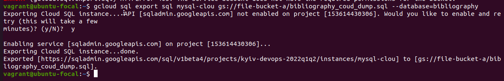

# Databases

## Part 1

After installing `mysql-{server,client}` packages, I went on to explore some of the basics of interacting with databases.
I have created a `bibliography` database containing 3 tables: `name`, `title`, `meta` all containing some information necessary for creating a Chicago style citation.
Then filled it out with a few entries of some books, articles, etc.
After that, I tried constructing a select statement that would give me data refering to authors, books, edition year, and a page for the citation.
The books have to be newer than year 2000:


Then I created `student` user that would only be able interact with `bibliography` database.
As well as a `guest` user with no priviliges just to see how that would look like.
Something like a 'guest' user could have view priviliges:

```
> GRANT SELECT ON bibliography.* TO 'guest'@'localhost';
```

Here's a database query from main db of users and priviliges:


## Part 2

I then used the existing db for creating and restoring from backups:


In order to send my database to Gcloud SQL(same as AWS RDS) I had to create an SQL instance (together with a compute instance) and then, either through cli or in console, upload it:

1. Upload the backup to a bucket.
2. Grant SQL instance permission to read bucket objects.
3. Run the command.


Executing connections and queries via cloud sdk is also relatively straightforward:


The next step was to make a dump from that db, gcloud does this in object storage like this:




## Part 3

For the mongodb part I installed a client and a server on a local VM and started out by inserting documents into a collection, which in turn have created this collection:


And then the data could be viewed with `.find()`:


